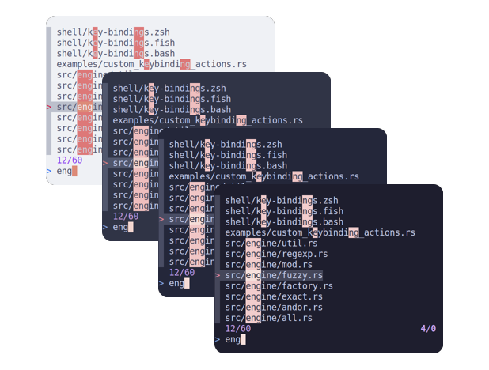
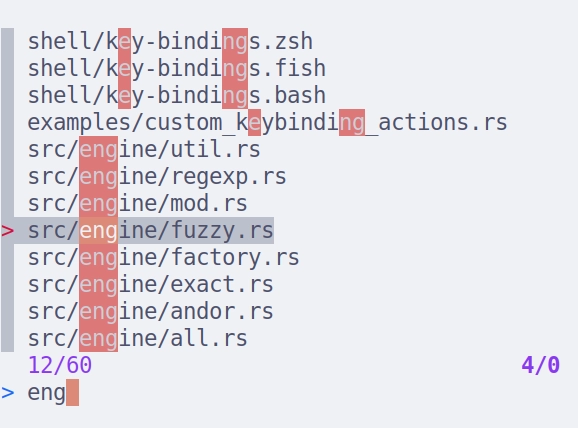
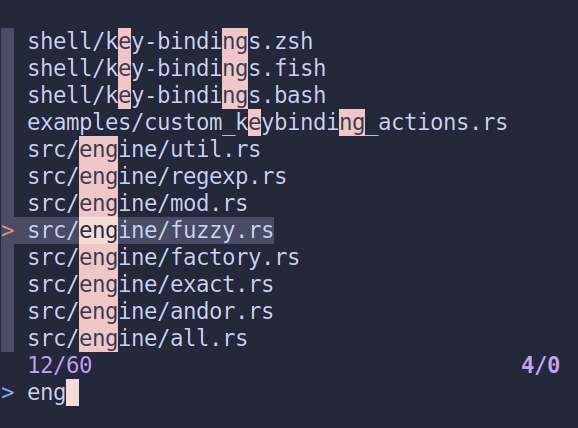
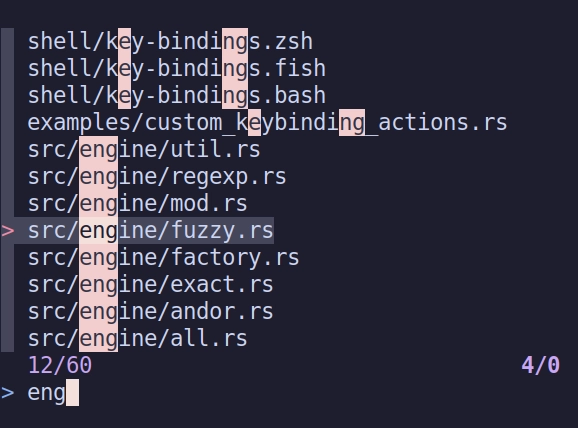

<h3 align="center">
	<br/>
	
	Catppuccin for <a href="https://github.com/lotabout/skim">skim</a>
	
</h3>

<p align="center">
	<a href="https://github.com/catppuccin/template/stargazers"></a>
	<a href="https://github.com/catppuccin/template/issues"></a>
	<a href="https://github.com/catppuccin/template/contributors"></a>
</p>

<p align="center">
	
</p>

## Usage

1. Choose one of the flavour palettes below.
2. Copy the corresponding snippet with an alias for the `sk` command specifying the colors. 
3. Add the snippet to your shell startup script (e.g. `~/.profile`, `~/.bashrc`, `~/.zshrc`, etc).

<details>
<summary>🌻 Latte</summary>

bash/zsh:
```sh
alias sk='sk --color='
```



</details>

<details>
<summary>🪴 Frappé</summary>

bash/zsh:
```sh
alias sk='sk --color='
```


</details>

<details>
<summary>🌺 Macchiato</summary>

bash/zsh:
```sh
alias sk='sk --color='
```



</details>

<details>
<summary>🌿 Mocha</summary>

bash/zsh:
```sh
alias sk='sk --color='
```



</details>

## 💝 Thanks to

- [Gabriel Magno](https://github.com/gabrielmagno)

&nbsp;

<p align="center">
	
</p>

<p align="center">
	Copyright &copy; 2021-present <a href="https://github.com/catppuccin" target="_blank">Catppuccin Org</a>
</p>

<p align="center">
	<a href="https://github.com/catppuccin/catppuccin/blob/main/LICENSE"></a>
</p>
